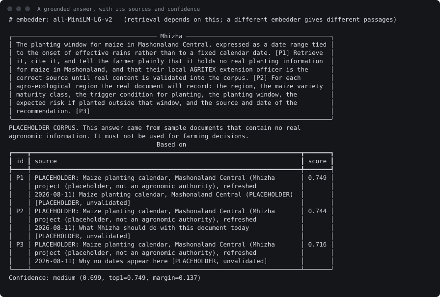
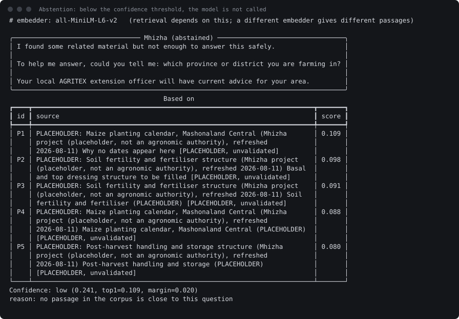
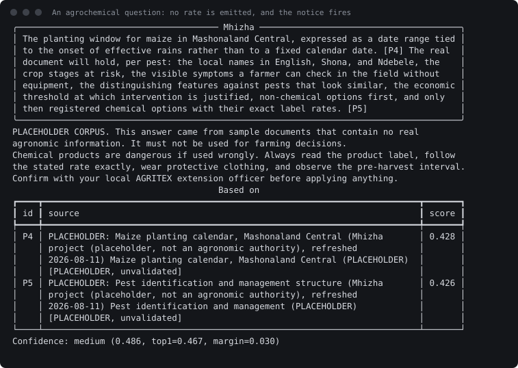
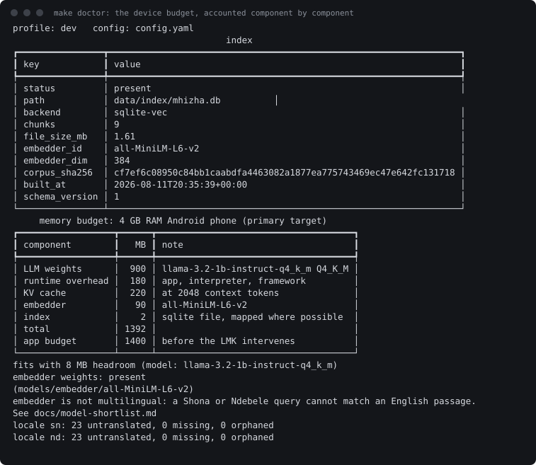

# CLI captures

Produced by `python3 scripts/capture_cli.py`, which runs the shipped entry
point against the placeholder corpus in this repository. Re-run it to check
these are current; nothing here is staged or hand-edited.

## A grounded answer, with its sources and confidence

`mhizha ask when should I plant maize in Mashonaland`

Every claim carries a passage id, and every passage names its source, publisher and refresh date. The placeholder banner is real: this corpus holds no agronomic content, and the system says so rather than sounding authoritative.



<details><summary>as text</summary>

```
╭─────────────────────────────────────── Mhizha ───────────────────────────────────────╮
│ The planting window for maize in Mashonaland Central, expressed as a date range tied │
│ to the onset of effective rains rather than to a fixed calendar date. [P1] Retrieve  │
│ it, cite it, and tell the farmer plainly that it holds no real planting information  │
│ for maize in Mashonaland, and that their local AGRITEX extension officer is the      │
│ correct source until real content is validated into the corpus. [P2] For each        │
│ agro-ecological region the real document will record: the region, the maize variety  │
│ maturity class, the trigger condition for planting, the planting window, the         │
│ expected risk if planted outside that window, and the source and date of the         │
│ recommendation. [P3]                                                                 │
╰──────────────────────────────────────────────────────────────────────────────────────╯
PLACEHOLDER CORPUS. This answer came from sample documents that contain no real 
agronomic information. It must not be used for farming decisions.
                                        Based on                                        
┏━━━━┳━━━━━━━━━━━━━━━━━━━━━━━━━━━━━━━━━━━━━━━━━━━━━━━━━━━━━━━━━━━━━━━━━━━━━━━━━┳━━━━━━━┓
┃ id ┃ source                                                                  ┃ score ┃
┡━━━━╇━━━━━━━━━━━━━━━━━━━━━━━━━━━━━━━━━━━━━━━━━━━━━━━━━━━━━━━━━━━━━━━━━━━━━━━━━╇━━━━━━━┩
│ P1 │ PLACEHOLDER: Maize planting calendar, Mashonaland Central (Mhizha       │ 0.749 │
│    │ project (placeholder, not an agronomic authority), refreshed            │       │
│    │ 2026-08-11) Maize planting calendar, Mashonaland Central (PLACEHOLDER)  │       │
│    │ [PLACEHOLDER, unvalidated]                                              │       │
│ P2 │ PLACEHOLDER: Maize planting calendar, Mashonaland Central (Mhizha       │ 0.744 │
│    │ project (placeholder, not an agronomic authority), refreshed            │       │
│    │ 2026-08-11) What Mhizha should do with this document today              │       │
│    │ [PLACEHOLDER, unvalidated]                                              │       │
│ P3 │ PLACEHOLDER: Maize planting calendar, Mashonaland Central (Mhizha       │ 0.716 │
│    │ project (placeholder, not an agronomic authority), refreshed            │       │
│    │ 2026-08-11) Why no dates appear here [PLACEHOLDER, unvalidated]         │       │
└────┴─────────────────────────────────────────────────────────────────────────┴───────┘
Confidence: medium (0.699, top1=0.749, margin=0.137)
```

</details>

## Abstention: below the confidence threshold, the model is not called

`mhizha ask how do I prune my avocado trees in winter`

An out-of-corpus question. Mhizha says what it does not know, asks the one clarifying question that would unblock it, and refers the farmer to their local AGRITEX extension officer. The retrieved passages are still shown, with their low scores, so the decision is inspectable.



<details><summary>as text</summary>

```
╭───────────────────────────────── Mhizha (abstained) ─────────────────────────────────╮
│ I found some related material but not enough to answer this safely.                  │
│                                                                                      │
│ To help me answer, could you tell me: which province or district you are farming in? │
│                                                                                      │
│ Your local AGRITEX extension officer will have current advice for your area.         │
╰──────────────────────────────────────────────────────────────────────────────────────╯
                                        Based on                                        
┏━━━━┳━━━━━━━━━━━━━━━━━━━━━━━━━━━━━━━━━━━━━━━━━━━━━━━━━━━━━━━━━━━━━━━━━━━━━━━━━┳━━━━━━━┓
┃ id ┃ source                                                                  ┃ score ┃
┡━━━━╇━━━━━━━━━━━━━━━━━━━━━━━━━━━━━━━━━━━━━━━━━━━━━━━━━━━━━━━━━━━━━━━━━━━━━━━━━╇━━━━━━━┩
│ P1 │ PLACEHOLDER: Maize planting calendar, Mashonaland Central (Mhizha       │ 0.109 │
│    │ project (placeholder, not an agronomic authority), refreshed            │       │
│    │ 2026-08-11) Why no dates appear here [PLACEHOLDER, unvalidated]         │       │
│ P2 │ PLACEHOLDER: Soil fertility and fertiliser structure (Mhizha project    │ 0.098 │
│    │ (placeholder, not an agronomic authority), refreshed 2026-08-11) Basal  │       │
│    │ and top dressing structure to be filled [PLACEHOLDER, unvalidated]      │       │
│ P3 │ PLACEHOLDER: Soil fertility and fertiliser structure (Mhizha project    │ 0.091 │
│    │ (placeholder, not an agronomic authority), refreshed 2026-08-11) Soil   │       │
│    │ fertility and fertiliser (PLACEHOLDER) [PLACEHOLDER, unvalidated]       │       │
│ P4 │ PLACEHOLDER: Maize planting calendar, Mashonaland Central (Mhizha       │ 0.088 │
│    │ project (placeholder, not an agronomic authority), refreshed            │       │
│    │ 2026-08-11) Maize planting calendar, Mashonaland Central (PLACEHOLDER)  │       │
│    │ [PLACEHOLDER, unvalidated]                                              │       │
│ P5 │ PLACEHOLDER: Post-harvest handling and storage structure (Mhizha        │ 0.080 │
│    │ project (placeholder, not an agronomic authority), refreshed            │       │
│    │ 2026-08-11) Post-harvest handling and storage (PLACEHOLDER)             │       │
│    │ [PLACEHOLDER, unvalidated]                                              │       │
└────┴─────────────────────────────────────────────────────────────────────────┴───────┘
Confidence: low (0.241, top1=0.109, margin=0.020)
reason: no passage in the corpus is close to this question
```

</details>

## An agrochemical question: no rate is emitted, and the notice fires

`mhizha ask how much cypermethrin per litre of water for fall armyworm on maize`

A dosage that is not verbatim in a validated passage is never emitted, in any phrasing. No validated passage exists here, so no rate appears, and the locale's chemical safety notice is attached with the referral to an extension officer.



<details><summary>as text</summary>

```
╭─────────────────────────────────────── Mhizha ───────────────────────────────────────╮
│ The planting window for maize in Mashonaland Central, expressed as a date range tied │
│ to the onset of effective rains rather than to a fixed calendar date. [P4] The real  │
│ document will hold, per pest: the local names in English, Shona, and Ndebele, the    │
│ crop stages at risk, the visible symptoms a farmer can check in the field without    │
│ equipment, the distinguishing features against pests that look similar, the economic │
│ threshold at which intervention is justified, non-chemical options first, and only   │
│ then registered chemical options with their exact label rates. [P5]                  │
╰──────────────────────────────────────────────────────────────────────────────────────╯
PLACEHOLDER CORPUS. This answer came from sample documents that contain no real 
agronomic information. It must not be used for farming decisions.
Chemical products are dangerous if used wrongly. Always read the product label, follow 
the stated rate exactly, wear protective clothing, and observe the pre-harvest interval.
Confirm with your local AGRITEX extension officer before applying anything.
                                        Based on                                        
┏━━━━┳━━━━━━━━━━━━━━━━━━━━━━━━━━━━━━━━━━━━━━━━━━━━━━━━━━━━━━━━━━━━━━━━━━━━━━━━━┳━━━━━━━┓
┃ id ┃ source                                                                  ┃ score ┃
┡━━━━╇━━━━━━━━━━━━━━━━━━━━━━━━━━━━━━━━━━━━━━━━━━━━━━━━━━━━━━━━━━━━━━━━━━━━━━━━━╇━━━━━━━┩
│ P4 │ PLACEHOLDER: Maize planting calendar, Mashonaland Central (Mhizha       │ 0.428 │
│    │ project (placeholder, not an agronomic authority), refreshed            │       │
│    │ 2026-08-11) Maize planting calendar, Mashonaland Central (PLACEHOLDER)  │       │
│    │ [PLACEHOLDER, unvalidated]                                              │       │
│ P5 │ PLACEHOLDER: Pest identification and management structure (Mhizha       │ 0.426 │
│    │ project (placeholder, not an agronomic authority), refreshed            │       │
│    │ 2026-08-11) Pest identification and management (PLACEHOLDER)            │       │
│    │ [PLACEHOLDER, unvalidated]                                              │       │
└────┴─────────────────────────────────────────────────────────────────────────┴───────┘
Confidence: medium (0.486, top1=0.467, margin=0.030)
```

</details>

## make doctor: the device budget, accounted component by component

`mhizha doctor`

The 4 GB phone profile is the default and stays the default. Every runtime component is costed against the headroom an app actually gets before the low-memory killer intervenes.



<details><summary>as text</summary>

```
profile: dev   config: /home/simbatmotsi/Documents/mhizha/config.yaml
                                        index                                        
┏━━━━━━━━━━━━━━━━┳━━━━━━━━━━━━━━━━━━━━━━━━━━━━━━━━━━━━━━━━━━━━━━━━━━━━━━━━━━━━━━━━━━┓
┃ key            ┃ value                                                            ┃
┡━━━━━━━━━━━━━━━━╇━━━━━━━━━━━━━━━━━━━━━━━━━━━━━━━━━━━━━━━━━━━━━━━━━━━━━━━━━━━━━━━━━━┩
│ status         │ present                                                          │
│ path           │ /home/simbatmotsi/Documents/mhizha/data/index/mhizha.db          │
│ backend        │ sqlite-vec                                                       │
│ chunks         │ 9                                                                │
│ file_size_mb   │ 1.61                                                             │
│ embedder_id    │ all-MiniLM-L6-v2                                                 │
│ embedder_dim   │ 384                                                              │
│ corpus_sha256  │ cf7ef6c08950c84bb1caabdfa4463082a1877ea775743469ec47e642fc131718 │
│ built_at       │ 2026-08-11T20:35:39+00:00                                        │
│ schema_version │ 1                                                                │
└────────────────┴──────────────────────────────────────────────────────────────────┘
     memory budget: 4 GB RAM Android phone (primary target)      
┏━━━━━━━━━━━━━━━━━━┳━━━━━━┳━━━━━━━━━━━━━━━━━━━━━━━━━━━━━━━━━━━━━┓
┃ component        ┃   MB ┃ note                                ┃
┡━━━━━━━━━━━━━━━━━━╇━━━━━━╇━━━━━━━━━━━━━━━━━━━━━━━━━━━━━━━━━━━━━┩
│ LLM weights      │  900 │ llama-3.2-1b-instruct-q4_k_m Q4_K_M │
│ runtime overhead │  180 │ app, interpreter, framework         │
│ KV cache         │  220 │ at 2048 context tokens              │
│ embedder         │   90 │ all-MiniLM-L6-v2                    │
│ index            │    2 │ sqlite file, mapped where possible  │
│ total            │ 1392 │                                     │
│ app budget       │ 1400 │ before the LMK intervenes           │
└──────────────────┴──────┴─────────────────────────────────────┘
fits with 8 MB headroom (model: llama-3.2-1b-instruct-q4_k_m)
embedder weights: present  
(/home/simbatmotsi/Documents/mhizha/models/embedder/all-MiniLM-L6-v2)
embedder is not multilingual: a Shona or Ndebele query cannot match an English passage. 
See docs/model-shortlist.md
locale sn: 23 untranslated, 0 missing, 0 orphaned
locale nd: 23 untranslated, 0 missing, 0 orphaned
```

</details>
